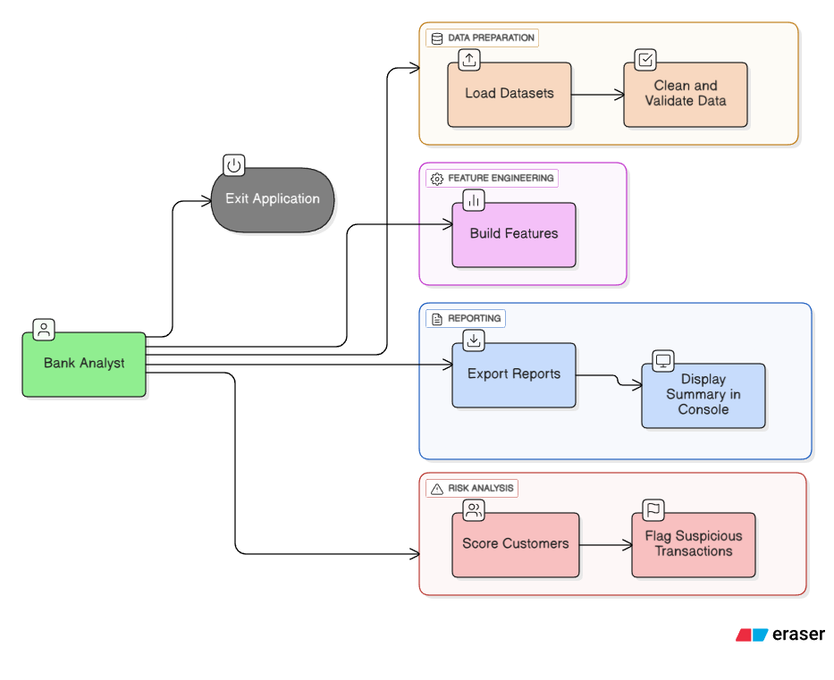
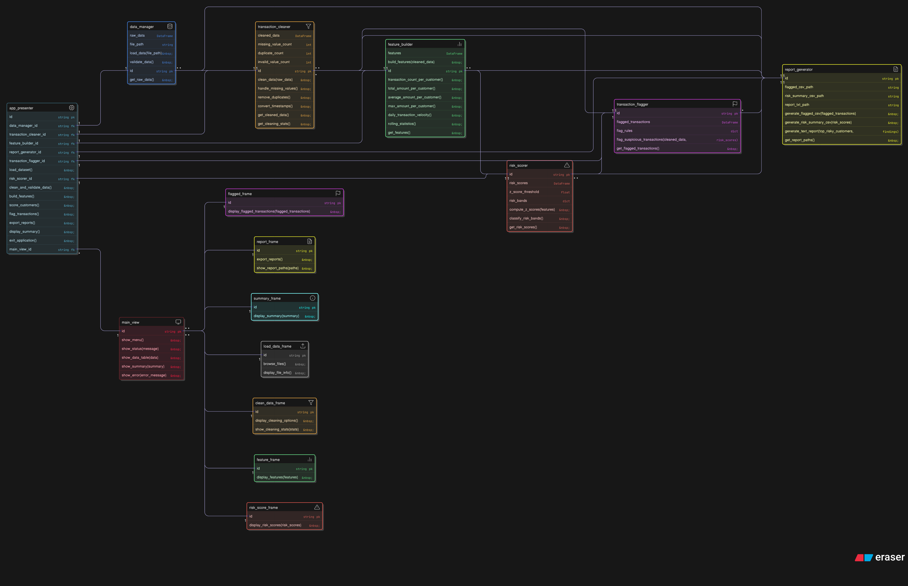

# Bank Transaction Analyzer

**Version:** 1.0
**Author:** Omar Kouta

A desktop application for analyzing bank transactions, scoring customers based on risk, and flagging suspicious transactions. The application provides a clean and interactive GUI using Tkinter, allowing users to load datasets, process data, and generate reports efficiently.

---

## Table of Contents

* [Features](#features)
* [Architecture](#architecture)
* [Installation](#installation)
* [Usage](#usage)
* [Project Structure](#project-structure)
* [Dataset](#dataset)
* [Screenshots & Diagrams](#screenshots--diagrams)
* [License](#license)

---

## Features

* Load CSV datasets containing bank transactions.
* Clean and validate transaction data.
* Build features for customer scoring.
* Compute risk scores for customers.
* Flag suspicious or high-risk transactions.
* Export detailed reports and view summaries.
* Interactive GUI with multiple tabs for Data, Summary, and Reports.

---

## Architecture

The application follows the **Model-View-Controller (MVC)** pattern:

* **View (`MainView`)**

  * Implements the GUI using Tkinter.
  * Displays data, summaries, and reports.
  * Handles user interactions and passes actions to the controller.

* **Controller (`MainController`)**

  * Manages application logic.
  * Coordinates data processing, feature building, scoring, flagging, and reporting.
  * Maintains state to track progress through the workflow.

* **Models**

  * `DataManager` — Handles loading of raw transaction data.
  * `TransactionCleaner` — Cleans and validates raw transactions.
  * `FeatureBuilder` — Builds features required for scoring.
  * `RiskScorer` — Computes risk scores for customers.
  * `TransactionFlagger` — Flags suspicious transactions based on risk scores.
  * `ReportGenerator` — Generates reports summarizing transactions and risk scores.

**Workflow:**
`Load Dataset → Clean Data → Build Features → Score Customers → Flag Transactions → Export Reports → Display Summary`

---

## Installation

1. Clone the repository:

```bash
git clone https://github.com/Omarkouta73/bank_transaction_analyzer.git
cd bank_transaction_analyzer
```

2. Install dependencies (Python 3.10+ recommended):

```bash
pip install -r requirements.txt
```

**Dependencies**:

* `tkinter`

---

## Usage

1. Run the application:

```bash
python main.py
```

2. Use the GUI to perform tasks in order:

* **Step 1:** Load your CSV dataset.
* **Step 2:** Clean and validate the data.
* **Step 3:** Build features for scoring.
* **Step 4:** Score customers based on risk.
* **Step 5:** Flag suspicious transactions.
* **Step 6:** Export reports.
* **Step 7:** View summary of all operations.

The status bar shows progress and messages, and dialog boxes provide success/error notifications.

---

## Dataset

The example dataset used (`data/Fraud_Detection.csv`) is based on the **[PaySim 1 financial transaction dataset on Kaggle](https://www.kaggle.com/datasets/ealaxi/paysim1)**.

* **Kaggle link:** [https://www.kaggle.com/datasets/ealaxi/paysim1](https://www.kaggle.com/datasets/ealaxi/paysim1)
* You can download the original dataset and place it in the `data/` folder to run the application.

---

## Project Structure

```
bank-transaction-analyzer/
├── main.py                          # Main entry point
├── requirements.txt                 # Python dependencies
├── Views/
│   └── main_view.py                 # Tkinter GUI implementation
├── Controllers/
│   └── controller.py
├── Models/
│   ├── data_manager.py
│   ├── transaction_cleaner.py
│   ├── feature_builder.py
│   ├── risk_scorer.py
│   ├── transaction_flagger.py
│   └── report_generator.py
├── data/
│   ├── Fraud_Detection.csv          # Example dataset from Kaggle
│   ├── usecase.png                  # UML use case diagram
│   └── class_diagram.png            # Class diagram
├── outputs/
│   ├── customer_risk_summary.csv    # Generated risk summary
│   ├── flagged_transactions.csv     # Flagged transactions report
│   └── report.txt                   # Full text report
└── README.md
```

---

## Screenshots & Diagrams

**Use Case Diagram:**


**Class Diagram:**
